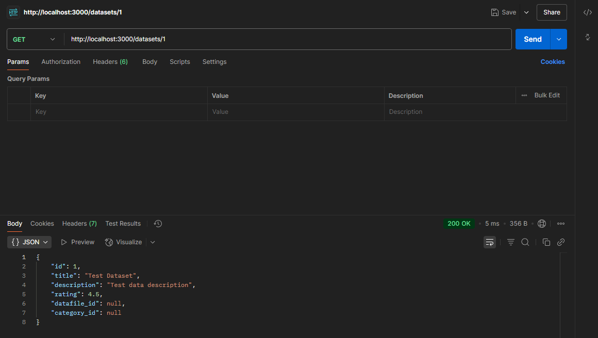
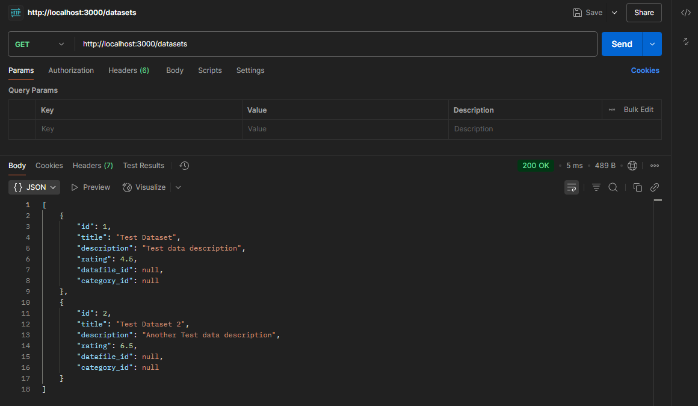
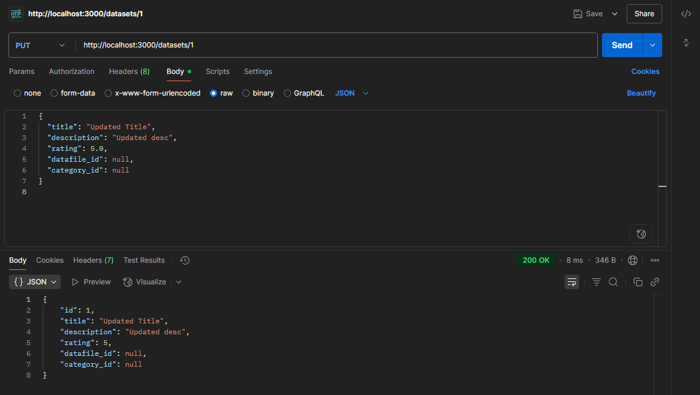
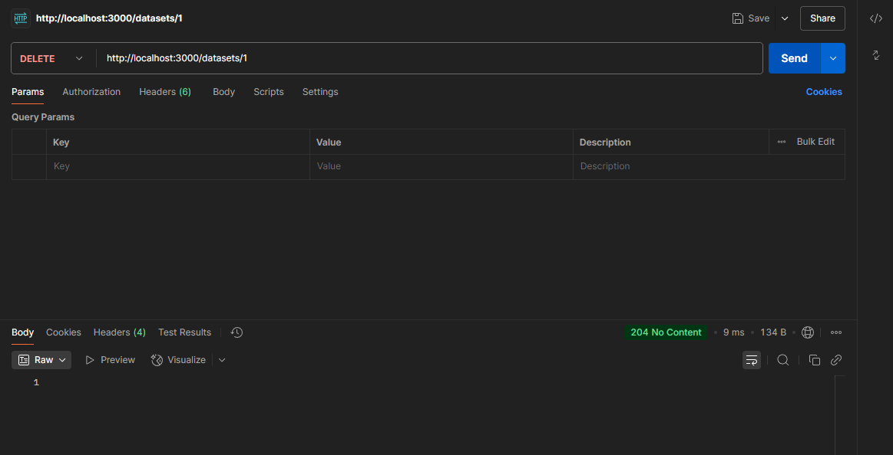
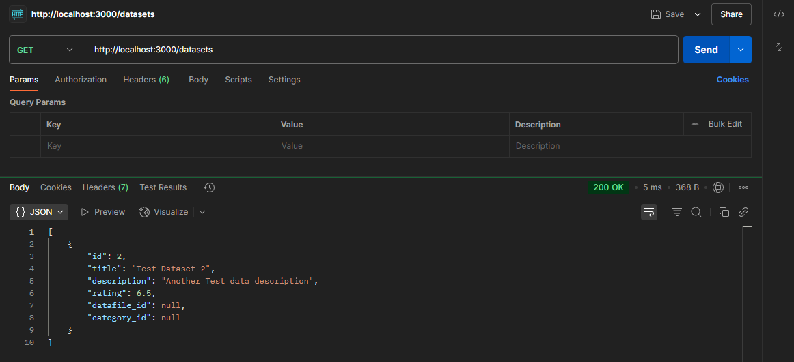

# RESTful сервіс для управління відкритими даними

## Реалізація RESTful сервісу

### .env

```text
MYSQL_HOST=localhost
MYSQL_PORT=3306
MYSQL_DATABASE=DB_NAME
MYSQL_USER=root
MYSQL_PASSWORD=
PORT=3000
```

### package.json

```json
{
  "name": "open-data-api",
  "type": "module",
  "devDependencies": {
    "nodemon": "^3.1.10",
    "vitepress": "^1.6.3"
  },
  "scripts": {
    "docs:dev": "vitepress dev docs",
    "docs:build": "vitepress build docs",
    "docs:preview": "vitepress preview docs",
    "rest:dev": "nodemon src/app.js"
  },
  "dependencies": {
    "dotenv": "^16.5.0",
    "express": "^5.1.0",
    "morgan": "^1.10.0",
    "mysql2": "^3.14.1"
  }
}
```

### src/app.js

```js
import express from 'express';
import morgan  from 'morgan';
import { config } from 'dotenv';
import { datasetsRouter } from './routes/dataset.routes.js';
config();

const app = express();
app.use(morgan('dev'));
app.use(express.json());

app.use('/datasets', datasetsRouter);

app.use((err, _req, res, _next) => {
  console.error(err);
  res.status(500).json({ error: 'Internal Server Error' });
});

app.listen(process.env.PORT || 3000, () =>
  console.log(`API ready on http://localhost:${process.env.PORT || 3000}`),
);
```

### src/db.js

```js
import mysql from 'mysql2/promise';
import dotenv from 'dotenv';
dotenv.config();

export const pool = mysql.createPool({
  host: process.env.MYSQL_HOST,
  port: process.env.MYSQL_PORT,
  user: process.env.MYSQL_USER,
  password: process.env.MYSQL_PASSWORD,
  database: process.env.MYSQL_DATABASE,
  waitForConnections: true,
  connectionLimit: 10,
});
```

### src/services/dataset.service.js

```js
import { pool } from '../db.js';

export const DatasetsService = {
  async findAll() {
    const [rows] = await pool.query('SELECT * FROM `Datasets` ORDER BY id');
    return rows;
  },

  async findById(id) {
    const [rows] = await pool.query('SELECT * FROM `Datasets` WHERE id = ?', [id]);
    return rows[0] ?? null;
  },

  async create(data) {
    const { title, description, rating, datafile_id, category_id } = data;
    const [result] = await pool.query(
      `INSERT INTO \`Datasets\`
           (title, description, rating, datafile_id, category_id)
       VALUES (?, ?, ?, ?, ?)`,
      [title, description, rating, datafile_id, category_id],
    );
    return { id: result.insertId, ...data };
  },

  async update(id, data) {
    const { title, description, rating, datafile_id, category_id } = data;
    const [result] = await pool.query(
      `UPDATE \`Datasets\`
       SET title = ?, description = ?, rating = ?,
           datafile_id = ?, category_id = ?
       WHERE id = ?`,
      [title, description, rating, datafile_id, category_id, id],
    );
    return result.affectedRows ? { id: Number(id), ...data } : null;
  },

  async remove(id) {
    const [result] = await pool.query('DELETE FROM `Datasets` WHERE id = ?', [id]);
    return Boolean(result.affectedRows);
  },
};
```

### src/controllers/dataset.controller.js

```js
import { DatasetsService } from '../services/dataset.service.js';

export const getAll = async (_req, res, next) => {
  try { res.json(await DatasetsService.findAll()); }
  catch (e) { next(e); }
};

export const getOne = async (req, res, next) => {
  try {
    const ds = await DatasetsService.findById(req.params.id);
    if (!ds) return res.status(404).json({ message: 'Not found' });
    res.json(ds);
  } catch (e) { next(e); }
};

export const create = async (req, res, next) => {
  try { res.status(201).json(await DatasetsService.create(req.body)); }
  catch (e) { next(e); }
};

export const update = async (req, res, next) => {
  try {
    const ds = await DatasetsService.update(req.params.id, req.body);
    if (!ds) return res.status(404).json({ message: 'Not found' });
    res.json(ds);
  } catch (e) { next(e); }
};

export const remove = async (req, res, next) => {
  try {
    const ok = await DatasetsService.remove(req.params.id);
    if (!ok) return res.status(404).json({ message: 'Not found' });
    res.status(204).end();
  } catch (e) { next(e); }
};
```

### src/routes/dataset.routes.js

```js
import { Router } from 'express';
import * as ctrl from '../controllers/dataset.controller.js';

export const datasetsRouter = Router();

datasetsRouter
  .get('/', ctrl.getAll)
  .get('/:id', ctrl.getOne)
  .post('/', ctrl.create)
  .put('/:id', ctrl.update)
  .delete('/:id', ctrl.remove);
```

## Тестування RESTful сервісу

### `GET http://localhost:3000/datasets`


### `GET http://localhost:3000/datasets/:id`



### `POST http://localhost:3000/datasets`



### `PUT http://localhost:3000/datasets/:id`



### `DELETE http://localhost:3000/datasets/:id`





